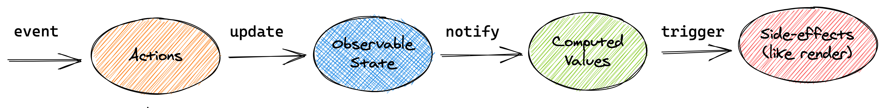

## MobX6

### 1. [MobX](https://mobx.js.org/README.html) 概述

MobX 是一个简单的可扩展的状态管理库，无样板代码风格简约。

目前最新版本为 6，版本 4 和版本 5 已不再支持。

在 MobX 6 中不推荐使用装饰器语法，因为它不是 ES 标准，并且标准化过程要花费很长时间，但是通过配置仍然可以启用装饰器语法。

MobX 可以运行在任何支持 ES5 的环境中，包含浏览器和 Node。

MobX 通常和 React 配合使用，但是在 [Angular](https://github.com/mobxjs/mobx-angular) 和 [Vue](https://github.com/mobxjs/mobx-vue) 中也可以使用 MobX。

### 2. MobX 光速入门

#### 2.1 下载

- mobx：MobX 核心库
- mobx-react-lite：仅支持函数组件
- mobx-react：既支持函数组件也支持类组件

`yarn add mobx@6.1.8 mobx-react-lite@3.2.0`

#### 2.2 核心概念

1. observable state：被 MobX 跟踪的状态。
2. action：允许修改状态的方法，在严格模式下只有 action 方法被允许修改状态。
3. computed：根据应用程序状态派生的新值，计算值。

#### 2.3 工作流程



#### 2.4 入门案例

##### 2.4.1 案例

计数器：在组件中显示数值状态，单击按钮使数值加一，单击按钮使数值重置。

```react
// Counter Component -> Counter 组件
// observer: 监控当前组件使用到的由 MobX 跟踪的 observable state, 当状态发生变化时通知 React 更新视图
import { observer } from "mobx-react-lite"

function Counter({ counterStore }) {
  return (
    <div>
      <p className="paragraph">{counterStore.count}</p>
      <button onClick={() => counterStore.increment()} className="button">加 1</button>
      <button onClick={() => counterStore.reset()} className="button">重置</button>
    </div>
  )
}

export default observer(Counter)
```

```react
// Counter Store -> 管理 Counter 组件的 Store
import { makeAutoObservable } from "mobx"

class CounterStore {
  // 数值状态
  count = 10
  constructor() {
    // 将参数对象中的属性设置为 observable state
    // 将参数对象中的方法设置为 action
    makeAutoObservable(this)
  }
	// 使数值状态加一
  increment() {
    this.count += 1
  }
	// 重置数值状态
  reset() {
    this.count = 0
  }
}

export default CounterStore
```

```react
// App Component -> 根组件
// 导入 Counter 组件
import Counter from "./components/Counter/Counter"
// 导入管理 Counter 组件的 Store
import CounterStore from "./stores/Counter/CounterStore"
// 创建管理 Counter 组件的 Store 实例对象
const counterStore = new CounterStore()

function App() {
  // 调用 Counter 组件并传入管理其状态的 Store
  return <Counter counterStore={counterStore} />
}

export default App
```

##### 2.4.2 makeAutoObservable

```javascript
// target: 将目标对象中的属性和方法设置为 observable state 和 action
// overrides: 覆盖默认设置, 将 target 对象中的某些属性或者方法设置为普通属性
// options: 配置对象, autoBind, 使 action 方法始终拥有正确的 this 指向
makeAutoObservable(target, overrides?, options?)
makeAutoObservable(this, {reset: false}, {autoBind: true})
```

##### 2.4.3 总结

状态变化更新视图的必要条件

1. 状态需要被标记为 `observable state`
2. 更改状态的方法需要被标记为 `action` 方法
3. 组件视图必须通过 `observer` 方法包裹

可以使用 `makeAutoObservable` 方法将对象属性设置为 `observable state`，将对象方法设置为 `action` 方法

可以使用 `observer` 方法监控当前组件使用到的由 MobX 跟踪的 `observable state`，当状态发生变化时通知 React 更新视图

### 3. TodoList

#### 3.1 创建初始 TodoListStore

1. 创建 TodoListStore，用于管理待办事项列表状态。

   ```react
   // TodoListStore.js
   class TodoListStore {
     todos = []
     constructor(todos) {
       if (todos) this.todos = todos
     }
   }
   export default TodoListStore
   ```

2. 创建 TodoViewStore，用于管理待办事项状态。

   ```react
   // TodoViewStore.js
   class TodoViewStore {
     id = Math.random()
     title = ""
     completed = false
     constructor(title) {
       this.title = title
     }
   }
   export default TodoViewStore
   ```

3. 创建 TodoListStore 实例对象并将其传入到 TodoListView 组件

   ```react
   // App.js
   import TodoListView from "./components/Todos/TodoListView"
   import TodoListStore from "./stores/Todos/TodoListStore"
   import TodoStore from "./stores/Todos/TodoStore"
   
   const counterStore = new CounterStore()
   
   const todoListStore = new TodoListStore([
     new TodoStore("Hello MobX"),
     new TodoStore("Hello React")
   ])
   
   function App() {
     return <TodoListView TodoListStore={todoListStore} />
   }
   ```

4. 渲染初始待办事项列表

   ```react
   // TodoListView.js
   function TodoListView({ TodoListStore }) {
     return (
       <ul className="todo-list">
         {TodoListStore.todos.map(todo => (
           <TodoView key={todo.id} todo={todo} />
         ))}
       </ul>
     )
   }
   ```

   ```react
   // TodoView.js
   function TodoView({ todo }) {
     return <label>{todo.title}</label>
   }
   ```

#### 3.2 创建待办事项

1. 在 TodoListStore 类中创建 createTodo 方法，用于向 todos 数组中添加待办事项

   ```react
   // TodoListStore.js
   import TodoStore from "./TodoStore"
   
   class TodoListStore {
     createTodo(title) {
       this.todos.push(new TodoStore(title))
     }
   }
   ```

2. 在 TodoHeader 组件中调用 createTodo 方法创建待办事项

   ```react
   // TodoListView.js
   function TodoListView({ TodoListStore }) {
     return <TodoHeader createTodo={title => TodoListStore.createTodo(title)} />
   }
   ```

   ```react
   // TodoHeader.js
   import { useState } from "react"
   
   function TodoHeader({ createTodo }) {
     const [title, setTitle] = useState("")
     return (
       <header className="header">
         <input
           value={title}
           onChange={event => setTitle(event.target.value)}
           onKeyUp={event => {
             if (event.key === "Enter") {
               createTodo(title)
               setTitle("")
             }
           }}
         />
       </header>
     )
   }
   ```

3. 设置状态变化更新视图的必要条件

   ```react
   // TodoListStore.js
   import { action, makeObservable, observable } from "mobx"
   
   class TodoListStore {
     constructor() {
       makeObservable(this, {
         todos: observable,
         createTodo: action
       })
     }
   }
   ```

   ```javascript
   // TodoListView.js
   import { observer } from "mobx-react-lite"
   
   function TodoListView (){}
   
   export default observer(TodoListView)
   ```

#### 3.3 创建 Store 上下文

我们希望在每个组件中都能够直接获取到 TodoListStore，而不是通过 props 属性传递的方式。

```react
// TodoListStore.js
import { createContext, useContext } from "react"

const TodoListStoreContext = createContext()

const TodoListStoreProvider = ({ store, children }) => {
  return (
    <TodoListStoreContext.Provider value={store}>
      {children}
    </TodoListStoreContext.Provider>
  )
}

const useTodoStore = () => {
  return useContext(TodoListStoreContext)
}

export { TodoListStore, TodoListStoreProvider, useTodoStore }
```

```react
// App.js
import { TodoListStore, TodoListStoreProvider } from "./stores/Todos/TodoListStore"

function App() {
  return (
    <TodoListStoreProvider store={todoListStore}>
      <TodoListView/>
      <Counter counterStore={counterStore} />
    </TodoListStoreProvider>
  )
}
```

```react
// TodoListView.js
import { useTodoListStore } from "../../stores/Todos/TodoListStore"

function TodoListView() {
  const todoListStore = useTodoListStore()
}
```

```react
import { useTodoListStore } from "../../stores/Todos/TodoListStore"

function TodoHeader() {
  const todoListStore = useTodoListStore()
  todoListStore.createTodo(title)
}
```

#### 3.4 删除待办事项

```react
// TodoListStore.js
class TodoListStore {
  constructor() {
    makeObservable(this, {
      removeTodo: action
    })
  }
  removeTodo(id) {
    const index = this.todos.findIndex(todo => todo.id === id)
    this.todos.splice(index, 1)
  }
}
```

```react
// TodoView.js
import { useTodoListStore } from "../../stores/Todos/TodoListStore"

function TodoView({ todo }) {
  const todoListStore = useTodoListStore()
  return <button onClick={() => todoListStore.removeTodo(todo.id)} className="destroy" />
}
```

#### 3.5 更改任务状态

```react
// TodoStore.js
import { makeObservable, observable, action } from "mobx"

class TodoStore {
  completed = false
  constructor() {
    makeObservable(this, {
      completed: observable,
      toggle: action
    })
  }
  toggle() {
    this.completed = !this.completed
  }
}
```

```react
// TodoView.js
import { observer } from "mobx-react-lite"

function TodoView({ todo }) {
  return (
    <li className={todo.completed ? "completed" : ""}>
      <input checked={todo.completed} onChange={() => todo.toggle()} className="toggle" type="checkbox" />
    </li>
  )
}

export default observer(TodoView)
```

#### 3.6 更正 this 指向

```react
<input onChange={() => todo.toggle()} />
<input onChange={todo.toggle}/> // this 指向会发生错误
```

```react
makeObservable(this, {
  toggle: action.bound
})
```

#### 3.7 计算待办事项数量

待办事项数量属于派生状态，即该状态依赖现有状态 (todos) 生成。

派生状态可以使用计算值实现，当依赖状态发生变化后，计算值自动更新。

```react
// TodoListStore.js
import { computed } from "mobx"

class TodoListStore {
  constructor() {
    makeObservable(this, {
      unCompletedTodoCount: computed
    })
  }
  get unCompletedTodoCount() {
    return this.todos.filter(todo => !todo.completed).length
  }
}
```

```react
// TodoFooter.js
import { useTodoListStore } from "../../stores/Todos/TodoListStore"
import { observer } from "mobx-react-lite"

function TodoFooter() {
  const todoListStore = useTodoListStore()
  return <strong>{todoListStore.unCompletedTodoCount}</strong> item left
}

export default observer(TodoFooter)
```

注意：计算值是被缓存的。

```react
get unCompletedTodoCount() {
  console.log("unCompletedTodoCount")
  return this.todos.filter(todo => !todo.completed).length
}
```

```react
{todoListStore.unCompletedTodoCount}
{todoListStore.unCompletedTodoCount}
{todoListStore.unCompletedTodoCount}
// 计算属性被调用多次, 但是方法内部的console.log 只会输出一次, 说明计算属性是被缓存的.
```

#### 3.8  待办事项过滤

待办事项过滤为计算值的练习任务。

```javascript
// TodoListStore.js
class TodoListStore {
  todos = []
  filter = "all"
  constructor() {
    makeObservable(this, {
      filter: observable,
      changeFilter: action,
      filterTodos: computed
    })
  }
  get filterTodos() {
    switch (this.filter) {
      case "all":
        return this.todos
      case "active":
        return this.todos.filter(todo => !todo.completed)
      case "completed":
        return this.todos.filter(todo => todo.completed)
      default:
        return this.todos
    }
  }
  changeFilter(filter) {
    this.filter = filter
  }
}
```

```react
// TodoFooter.js
function TodoFooter() {
  const todoListStore = useTodoListStore()
  return (
    <footer className="footer">
      <ul className="filters">
        <li>
          <button
            onClick={() => todoListStore.changeFilter("all")}
            className={todoListStore.filter === "all" ? "selected" : ""}
          >
            All
          </button>
        </li>
        <li>
          <button
            onClick={() => todoListStore.changeFilter("active")}
            className={todoListStore.filter === "active" ? "selected" : ""}
          >
            Active
          </button>
        </li>
        <li>
          <button
            onClick={() => todoListStore.changeFilter("completed")}
            className={todoListStore.filter === "completed" ? "selected" : ""}
          >
            Completed
          </button>
        </li>
      </ul>
    </footer>
  )
}
```

```react
// TodoListView.js
function TodoListView() {
  const todoListStore = useTodoListStore()
  return (
    <ul className="todo-list">
      {todoListStore.filterTodos.map(todo => <TodoView key={todo.id} todo={todo} />)}
    </ul>
  )
}
```

#### 3.9 加载远端任务

1. 下载并启动 json-server

   `npm install -g json-server`

   `json-server ./src/todo.json --port 3005`

   `yarn add axios`

2. 创建 loadTodos 方法用于加载初始任务

   ```react
   // TodoListStore.js
   import axios from "axios"
   import { runInAction } from "mobx"
   
   class TodoListStore {
     constructor(todos) {
       this.loadTodos()
     }
     async loadTodos() {
       let todos = await axios.get("http://localhost:3005/todos").then(response => response.data)
       runInAction(() => todos.forEach(todo => this.todos.push(todo)))
     }
   }
   ```

3. 解决远端加载待办事项无法切换状态的问题

   原因是远端加载待办事项的任务对象的原型对象上没有 toggle 方法。

   ```react
   import TodoStore from "./TodoStore"
   
   class TodoListStore {
     async loadTodos() {
       runInAction(() => todos.forEach(todo => this.todos.push(new TodoStore(todo.title))))
     }
   }
   ```

#### 3.9 创建 RootStore

通过创建 RootStore 可以将 CounterStore 和 TodoListStore 进行合并，实现在任何组件中都可以访问任何状态，方便全局状态共享。

```react
// RootStore.js
import CounterStore from "./Counter/CounterStore"
import TodoListStore from "./Todos/TodoListStore"
import { createContext, useContext } from "react"

class RootStore {
  constructor() {
    this.counterStore = new CounterStore()
    this.todoListStore = new TodoListStore()
  }
}

const RootStoreContext = createContext()

const RootStoreProvider = ({ store, children }) => {
  return (
    <RootStoreContext.Provider value={store}>
      {children}
    </RootStoreContext.Provider>
  )
}

const useRootStore = () => {
  return useContext(RootStoreContext)
}

export { RootStore, RootStoreProvider, useRootStore }
```

```react
// App.js
import Counter from "./components/Counter/Counter"
import TodoListView from "./components/Todos/TodoListView"
import { RootStore, RootStoreProvider } from "./stores/RootStore"

const rootStore = new RootStore()

function App() {
  return (
    <RootStoreProvider store={rootStore}>
      <TodoListView />
      <Counter />
    </RootStoreProvider>
  )
}

export default App
```

```react
// 消费 RootStore 的其他组件
import { useRootStore } from "../../stores/RootStore"

function TodoHeader() {
  const { todoListStore } = useRootStore()
}

function Counter() {
  const { counterStore } = useRootStore()
}
```

### 4. 数据监测

#### 4.1 autorun 方法

1. 监控数据变化执行副作用，接收一个函数作为参数，参数函数用来执行副作用，当参数函数内部使用的 observable state, computed 发生变化时函数会运行，初始运行 autorun 方法时参数函数也会运行一次。

   ```react
   import { autorun } from "mobx"
   import { useEffect } from "react"
   
   function Counter() {
     const { counterStore } = useRootStore()
     useEffect(() => {
       // 确保 autorun 方法只被初始化一次
       autorun(() => {
         console.log(counterStore.count)
       })
     }, [])
   }
   ```

2. 对于基本数据类型，属于值传递，mobx 只能跟踪到原始属性，跟踪不到复制后的值。

   ```react
   useEffect(() => {
       let count = counterStore.count
       autorun(() => {
         // 错误写法, mobx 跟踪不到变量 count
         console.log(count)
       })
     }, [])
   ```

3. 对于引用数据类型，只要引用地址不发生变化，mobx 就可以进行跟踪

   ```react
   // CounterStore.js
   class CounterStore {
     person = { name: "张三" }
   }
   ```

   ```react
   // Counter 组件
   function Counter() {
     const { counterStore } = useRootStore()
     useEffect(() => {
       const person = counterStore.person
       autorun(() => {
         console.log(person.name)
       })
     }, [])
     return (
       <div>
         <p>{counterStore.person.name}</p>
         <button onClick={() => runInAction(() => (counterStore.person.name = "李四"))}>李四</button>
         <button onClick={() => runInAction(() => (counterStore.person = { name: "王五" }))}>王五</button>
       </div>
     )
   }
   ```

4. 去除控制台中和 useEffect 相关的 ⚠️

   在 react 17 版本中，官方团队修改了脚手架工具，允许直接在外部声明 .eslintrc 文件覆盖 eslint 配置，不需要使用 package.json, react-app-rewired 和 customize-cra 就可用实现 eslint 配置

   在项目的根目录下新建 `.eslintrc.js ` 文件并加入如下内容

   ```react
   module.exports = {
     plugins: ["react-hooks"],
     rules: {
       "react-hooks/exhaustive-deps": 0
     }
   }
   ```

   注意此处不需要下载 [eslint-plugin-react-hooks](https://www.npmjs.com/package/eslint-plugin-react-hooks) 插件，`create-react-app` 脚手架工具内部已经内置。

   配置完成后重新启动应用。

#### 4.2 reaction 方法

监控状态变化执行副作用，接收两个函数作为参数，第一个函数返回要监控的状态，第二个函数用来执行副作用，只有当第一个函数返回的状态发生变化时，第二个函数才会执行。reaction 方法提供了更加细颗粒度的状态控制。

和 autorun 不同，reaction 初始时不会执行副作用。

```react
import { reaction } from "mobx"

function Counter() {
	useEffect(() => {
  	reaction(
      () => counterStore.count,
      (current, previous) => {
        console.log(current)
        console.log(previous)
      }
    )
  }, []) 
}
```


