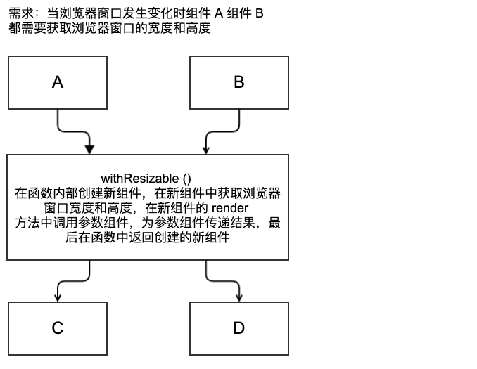
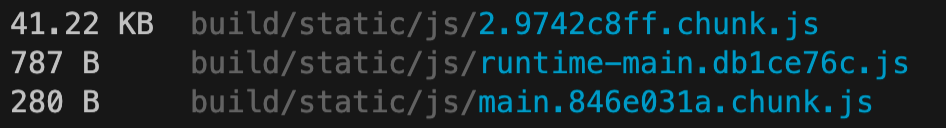
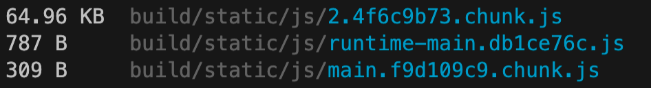
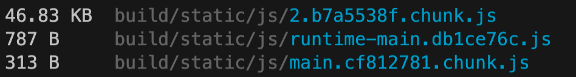
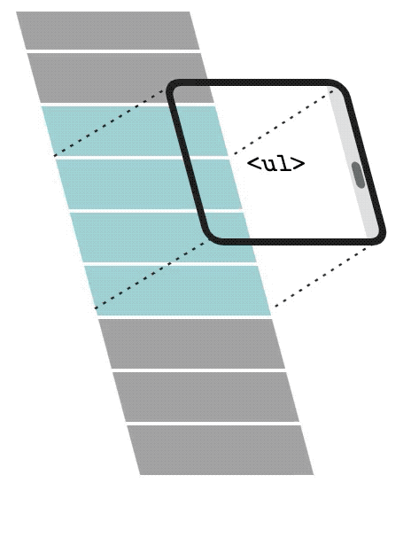

### React 性能优化最佳实践

React 性能优化的核心是减少渲染真实 DOM 节点的频率，减少 virtual DOM diff 的频率。

### 1. 组件卸载前进行清理操作

在组件中为 window 注册的全局事件, 以及定时器, 在组件卸载前要清理掉, 防止组件卸载后继续执行影响应用性能.

需求：使用 useState 保存一个数值，然后开启定时器改变数值，卸载组件查看定时器是否还在运行。

```react
import React, { useState, useEffect } from "react"
import ReactDOM from "react-dom"

const App = () => {
  let [index, setIndex] = useState(0)
  useEffect(() => {
    let timer = setInterval(() => {
      console.log(index)
      setIndex(++index)
    }, 1000)
    return () => clearInterval(timer)
  }, [])
  return (
    <button onClick={() => ReactDOM.unmountComponentAtNode(document.getElementById("root"))}>
      {index}
    </button>
  )
}

export default App
```

### 2. 使用纯组件降低组件重新渲染的频率

1. 什么是纯组件

   相同的输入 (state、props) 呈现相同的输出. 在输入内容相同的情况下纯组件不会被重新渲染. 

2. 如何实现纯组件

   React 提供了 PureComponent 类, 类组件在继承它以后, 类组件就变成了纯组件. 纯组件会对 props 和 state 进行浅层比较, 如果上一次的 props、state 和下一次的 props、state 相同, 则不会重新渲染组件.

3. 什么是浅层比较

   浅比较指的是比较基本数据类型是否具有相同的值, 比如1是否等于1, true是否等于true. 比较复杂数据类型的第一层值是否相同。

4. 浅层比较难道没有性能消耗吗

   和进行 diff 比较操作相比，浅层比较将消耗更少的性能。diff 操作会重新遍历整颗 virtualDOM 树, 而浅层比较值操作当前组件的 state 和 props。

5. 需求：在状态对象中存储 name 值为张三，组件挂载完成后将 name 属性的值再次更改为张三，然后分别将 name 传递给纯组件和非纯组件，查看结果。

   ```react
   import React from "react"
   export default class App extends React.Component {
     constructor() {
       super()
       this.state = {name: "张三"}
     }
     updateName() {
       setInterval(() => this.setState({name: "张三"}), 1000)
     }
     componentDidMount() {
       this.updateName()
     }
     render() {
       return (
         <div>
           <RegularComponent name={this.state.name} />
           <PureChildComponent name={this.state.name} />
         </div>
       )
     }
   }
   
   class RegularComponent extends React.Component {
     render() {
       console.log("RegularComponent")
       return <div>{this.props.name}</div>
     }
   }
   
   class PureChildComponent extends React.PureComponent {
     render() {
       console.log("PureChildComponent")
       return <div>{this.props.name}</div>
     }
   }
   ```

### 3. 使用 React.memo 进行组件缓存

React.memo 是一个高阶组件.

1. 什么是高阶组件 Higher Order Component ( HOC )

   高阶组件是 React 应用中共享代码, 增加逻辑复用的一种方式. 比如 A 组件和 B 组件都需要使用一个相同的逻辑，如何将逻辑抽取到一个公共的地方呢？答案就是使用高阶组件。

   高阶组件的核心思想就是在组件的外层再包裹一层执行逻辑的组件，在外层组件中执行逻辑，再将逻辑执行的结果传递到内层组件。

   高阶组件形式是一个函数，**接收组件作为参数, 返回一个新的组件**. 参数组件就是需要复用逻辑的组件，函数内部返回的新组件就是执行逻辑的组件，在新组件内部执行完逻辑以后再调用参数组件并将逻辑结果传递给参数组件。

   

   函数名通常以 with 开头, 接收的组件形参名称为 WrappedComponent, 返回的组件名称和函数名称一样, 只不过 with 中的 w 要大写.

   ```react
   import React from "react"
   
   export class A extends React.Component {
     render() {
       return <div>{this.props.sizes.join("-")}</div>
     }
   }
   export class B extends React.Component {
     render() {
       return <div>{this.props.sizes.join("-")}</div>
     }
   }
   
   const WrappedA = withResizable(A)
   const WrappedB = withResizable(B)
   ```

   ```react
   function withResizable(WrappedComponent) {
     class WithResizable extends React.Component {
       constructor() {
         super()
         this.state = {
           sizes: [window.innerWidth, window.innerHeight]
         }
         this.updateSizes = this.updateSizes.bind(this)
       }
       updateSizes() {
         this.setState({
           sizes: [window.innerWidth, window.innerHeight]
         })
       }
       componentDidMount() {
         window.addEventListener("resize", this.updateSizes)
       }
       render() {
         return <WrappedComponent sizes={this.state.sizes} />
       }
     }
     return WithResizable
   }
   ```

    ```react
   import React from "react"
   
   export default class App extends React.Component {
     render() {
       return (
         <div>
           <WrappedA />
           <WrappedB />
         </div>
       )
     }
   }
    ```

2. React.memo 介绍

   与 PureComponent 相似, 如果上一次输入的 props 和下一次输入的 props 相同, 则组件不会重新渲染, 从而使组件更高效.

   PureComponent 应用于类组件, React.memo 应用于函数组件.

   React.memo 使用的也是使用浅层比较.

3. React.memo 使用

   ```react
   import React, { useState, useEffect, memo } from "react"
   
   export default function App() {
     let [index, setIndex] = useState(0)
     let [name] = useState("张三")
     useEffect(() => {
       let timer = setInterval(() => {
         setIndex(++index)
       }, 1000)
       return () => clearInterval(timer)
     }, [])
     return (
       <>
         {index}
         <ShowNameMemo name={name} />
       </>
     )
   }
   
   function ShowName(props) {
     console.log("ShowName")
     return <div>{props.name}</div>
   }
   
   const ShowNameMemo = memo(ShowName)
   ```

4. 为 memo 传递比较逻辑

   memo 方法可以自定义比较逻辑，如果为组件传递的数据涉及嵌套层次，就可以自定义比较逻辑。

   memo 方法的第二个参数即为比较函数.

   比较函数的第一个参数为上一次的 props, 比较函数的第二个参数为下一次的 props, 比较函数返回 true, 不进行渲染, 比较函数返回 false, 组件重新渲染.

   ```react
   import React, { useState, useEffect } from "react"
   
   const Home = () => {
     let [index, setIndex] = useState(0)
     useEffect(() => {
       const timer = setInterval(() => {
         setIndex(++index)
       }, 1000)
       return () => clearInterval(timer)
     })
   
     return (
       <>
         <div>{index}</div>
         <ShowPersonMemoComponent person={{ name: "张三", age: 20 }} />
       </>
     )
   }
   
   export default Home
   ```

   ```react
   // props => {person: {name: "张三", age: 20}}
   const ShowPersonComponent = ({ name, age }) => {
     console.log("ShowNameComponent Rendering")
     return <div>{name} {age}</div>
   }
   
   const ShowPersonMemoComponent = React.memo(ShowPersonComponent, comparePerson)
   
   function comparePerson(prevProps, nextProps) {
     if (prevProps.name === nextProps.name && prevProps.age === nextProps.age) {
       return true
     }
     return false
   }
   ```

### 4. shouldComponentUpdate 减少组件渲染频率

shouldComponentUpdate 是类组件的生命周期函数, 在组件 props 或者 state 发生改变后调用. 函数默认返回 true, 重新渲染组件, 返回 false, 阻止组件重新渲染.

函数的第一个参数为 nextProps, 第二个参数为 nextState.

需求: 在页面中展示员工信息, 员工信息包括, 姓名, 年龄, 薪水, 职位等等. 但是在页面中只想展示姓名和年龄. 也就是说只有姓名和年龄发生变化时才有必要重新渲染组件, 如果员工的其他信息发生了变化没必要重新渲染组件.

```react
import React from "react"

export default class App extends React.Component {
  constructor() {
    super()
    this.state = {name: "张三", age: 20, job: "waiter"}
  }
  componentDidMount() {
    setTimeout(() => this.setState({ job: "chef" }), 1000)
  }

  shouldComponentUpdate(nextProps, nextState) {
    if (this.state.name !== nextState.name || this.state.age !== nextState.age) {
      return true
    }
    return false
  }

  render() {
    console.log("rendering")
    let { name, age } = this.state
    return <div>{name} {age}</div>
  }
}
```

### 5. 使用组件懒加载

使用组件懒加载可以减少 bundle 文件大小, 加快组件呈递速度.

1. 路由组件懒加载

   ```react
   import {BrowserRouter, Link, Redirect, Switch, Route } from "react-router-dom"
   import { lazy, Suspense } from "react"
   import Home from "./pages/Home"
   // import About from "./pages/About"
   
   const About = lazy(() => import(/* webpackChunkName: "about" */ "./pages/About"))
   
   function App() {
     return (
       <BrowserRouter>
         <div>
           <Link to="/home">Home</Link> - <Link to="/about">About</Link>
         </div>
         <Switch>
           <Route path="/home">
             <Home />
           </Route>
           <Route path="/about">
             <Suspense fallback={<div>loading....</div>}>
               <About />
             </Suspense>
           </Route>
           <Route path="/">
             <Redirect to="/home" />
           </Route>
         </Switch>
       </BrowserRouter>
     )
   }
   
   export default App
   ```

2. 根据条件进行组件懒加载

   适用于组件不会随条件频繁切换。好处是可以将两个组件全部从 bundle 中分离出来，减少 bundle 文件的体积。

   ```react
   import { lazy, Suspense } from "react"
   
   export default function About() {
     let LazyComponent = null
     if (true) {
       LazyComponent = lazy(() => import(/* webpackChunkName: "list" */ "../components/List"))
     } else {
       LazyComponent = lazy(() => import(/* webpackChunkName: "news" */ "../components/News"))
     }
     return (
       <div>
         about page works
         <Suspense fallback={<div>loading...</div>}>
           <LazyComponent />
         </Suspense>
       </div>
     )
   }
   ```

### 6. 使用 Fragment 以避免额外的标记

React 组件中返回的 jsx 如果有多个同级元素, 多个同级元素必须要有一个共同的父级.

```react
function App() {
  return (
    <div>
      <div>message a</div>
      <div>message b</div>
    </div>
  )
}
```

为了满足这个条件我们通常都会在最外层添加一个div, 但是这样的话就会多出一个无意义的标记, 如果每个组件都多出这样的一个无意义标记的话, 浏览器渲染引擎的负担就会加剧. 

为了解决这个问题, React 推出了 fragment 占位符标记. 使用占位符标记既满足了拥有共同父级的要求又不会多出额外的无意义标记.

```react
import { Fragment } from "react"

function App() {
  return (
    <Fragment>
      <div>message a</div>
      <div>message b</div>
    </Fragment>
  )
}
```

```react
function App() {
  return (
    <>
      <div>message a</div>
      <div>message b</div>
    </>
  )
}
```

### 7. 不要使用内联函数定义

在使用内联函数后, render 方法每次运行时都会创建该函数的新实例, 导致 React 在进行 Virtual DOM 比对时, 新旧函数比对不相等，导致React 总是为元素绑定新的函数实例, 而旧的函数实例又要交给垃圾回收器处理. 

```react
import React from "react"

export default class App extends React.Component {
  constructor() {
    super()
    this.state = {
      inputValue: ""
    }
  }
  render() {
    return (
      <input
        value={this.state.inputValue}
        onChange={e => this.setState({ inputValue: e.target.value })}
        />
    )
  }
}
```

正确的做法是在组件中单独定义函数, 将函数绑定给事件.

```react
import React from "react"

export default class App extends React.Component {
  constructor() {
    super()
    this.state = {
      inputValue: ""
    }
  }
  setInputValue = e => {
    this.setState({ inputValue: e.target.value })
  }
  render() {
    return (
      <input value={this.state.inputValue} onChange={this.setInputValue} />
    )
  }
}
```

### 8. 在构造函数中进行函数this绑定

在类组件中如果使用 fn() {} 这种方式定义事件函数, 事件函数 this 默认指向 undefined. 也就是说函数内部的 this 指向需要被更正.

可以在构造函数中对函数的 this 进行更正, 也可以在行内进行更正, 两者看起来没有太大区别, 但是对性能的影响是不同的.

```react
export default class App extends React.Component {
  handleClick() {
    console.log(this)
  }
  render() {
    return <button onClick={this.handleClick.bind(this)}>按钮</button>
  }
}
```

上面代码的问题是, render 方法每次执行时都会调用 bind 方法生成新的函数实例.

```react
export default class App extends React.Component {
  constructor() {
    super()
    this.handleClick = this.handleClick.bind(this)
  }
  handleClick() {
    console.log(this)
  }
  render() {
    return <button onClick={this.handleClick}>按钮</button>
  }
}
```

上面代码优化了在每次调用 render 方法时都生成新函数实例的问题, 构造函数只执行一次, 所以函数 this 指向更正的代码也只执行一次.

### 9. 类组件中的箭头函数

在类组件中使用箭头函数不会存在 this 指向问题, 因为箭头函数本身并不绑定 this.

```react
export default class App extends React.Component {
  handleClick = () => console.log(this)
  render() {
    return <button onClick={this.handleClick}>按钮</button>
  }
}
```

箭头函数在 this 指向问题上占据优势, 但是同时也有不利的一面.

当使用箭头函数时, 该函数被添加为类的实例对象属性, 而不是原型对象属性. 如果组件被多次重用, 每个组件实例对象中都将会有一个相同的函数实例, 降低了函数实例的可重用性造成了资源浪费.

综上所述, 更正函数内部 this 指向的最佳做法仍是在构造函数中使用 bind 方法进行绑定

### 10. 避免使用内联样式属性

当使用内联 style 为元素添加样式时, 内联 style 会被编译为 JavaScript 代码, 通过 JavaScript 代码将样式规则映射到元素的身上, 浏览器就会花费更多的时间执行脚本和渲染 UI, 从而增加了组件的渲染时间.

```react
function App() {
  return <div style={{ backgroundColor: "skyblue" }}>App works</div>
}
```

在上面的组件中, 为元素附加了内联样式, 添加的内联样式为 JavaScript 对象, backgroundColor 需要被转换为等效的 CSS 样式规则, 然后将其应用到元素, 这样涉及到脚本的执行.

更好的办法是将 CSS 文件导入样式组件.

### 11. 优化条件渲染

频繁的挂载和卸载组件是一项耗性能的操作, 为了确保应用程序的性能, 应该减少组件挂载和卸载的次数.

在 React 中我们经常会根据条件渲染不同的组件. 条件渲染是一项必做的优化操作.

```react
function App() {
  if (true) {
    return (
      <>
        <AdminHeader />
        <Header />
        <Content />
      </>
    )
  } else {
    return (
      <>
        <Header />
        <Content />
      </>
    )
  }
}
```

在上面的代码中, 当渲染条件发生变化时, React 内部在做 Virtual DOM 比对时发现, 刚刚第一个组件是 AdminHeader, 现在第一个组件是 Header, 刚刚第二个组件是 Header, 现在第二个组件是 Content, 组件发生了变化, React 就会卸载 AdminHeader、Header、Content, 重新挂载 Header 和 Content, 这种挂载和卸载就是没有必要的.

```react
function App() {
  return (
    <>
      {true && <AdminHeader />}
      <Header />
      <Content />
    </>
  )
}
```

### 12. 不要在 render 方法中更改应用状态

当应用程序状态发生更改时, React 会调用 render 方法, 如果在 render 方法中继续更改应用程序状态, 就会发生 render 方法递归调用导致应用报错.


```react
export default class App extends React.Component {
  constructor() {
    super()
    this.state = {name: "张三"}
  }
  render() {
    this.setState({name: "李四"})
    return <div>{this.state.name}</div>
  }
}
```

与其他生命周期函数不同, render 方法应该被作为纯函数. 这意味着, 在 render 方法中不要做以下事情, 比如不要调用 setState 方法, 不要使用其他手段查询更改原生 DOM 元素, 以及其他更改应用程序的任何操作. render 方法的执行要根据状态的改变, 这样可以保持组件的行为和渲染方式一致.

### 13. 为组件创建错误边界

默认情况下, 组件渲染错误会导致整个应用程序中断, 创建错误边界可确保在特定组件发生错误时应用程序不会中断.

错误边界是一个 React 组件, 可以捕获子级组件在渲染时发生的错误, 当错误发生时, 可以将错误记录下来, 可以显示备用 UI 界面.

错误边界涉及到两个生命周期函数, 分别为 getDerivedStateFromError 和 componentDidCatch.

getDerivedStateFromError 为静态方法, 方法中需要返回一个对象, 该对象会和state对象进行合并, 用于更改应用程序状态.

componentDidCatch 方法用于记录应用程序错误信息. 该方法的参数就是错误对象.

```react
// ErrorBoundaries.js
import React from "react"
import App from "./App"

export default class ErrorBoundaries extends React.Component {
  constructor() {
    super()
    this.state = {
      hasError: false
    }
  }
  componentDidCatch(error) {
    console.log("componentDidCatch")
  }
  static getDerivedStateFromError() {
    console.log("getDerivedStateFromError")
    return {
      hasError: true
    }
  }
  render() {
    if (this.state.hasError) {
      return <div>发生了错误</div>
    }
    return <App />
  }
}
```

```react
// App.js
import React from "react"

export default class App extends React.Component {
  render() {
    // throw new Error("lalala")
    return <div>App works</div>
  }
}
```

```react
// index.js
import React from "react"
import ReactDOM from "react-dom"
import ErrorBoundaries from "./ErrorBoundaries"

ReactDOM.render(<ErrorBoundaries />, document.getElementById("root"))
```

注意: 错误边界不能捕获异步错误, 比如点击按钮时发生的错误.

### 14. 避免数据结构突变

组件中 props 和 state 的数据结构应该保持一致, 数据结构突变会导致输出不一致.

```react
export default class App extends React.Component {
  constructor() {
    super()
    this.state = {
      employee: {
        name: "张三",
        age: 20
      }
    }
    this.handleClick = this.handleClick.bind(this)
  }
  handleClick() {
    this.setState({
      employee: {
        name: "李四"
      }
    })
  }
  render() {
    const { name, age } = this.state.employee
    return (
      <div>
        <div>{name} {age}</div>
        <button onClick={this.handleClick}>更改</button>
      </div>
    )
  }
}
```

### 15. 为列表数据添加唯一标识

当需要渲染列表数据时, 我们应该为每一个列表项添加 key 属性, key 属性的值必须是唯一的.

key 属性可以让 React 直接了当的知道哪些列表项发生了变化, 从而避免了 React 内部逐一遍历 Virtual DOM 查找变化所带来的性能消耗. 避免了元素因为位置变化而导致的重新创建.

当列表数据没有唯一标识时, 可以临时使用索引作为 key 属性的值, 但是仅限于列表项是静态的, 不会被动态改变. 比如不会对列表项进行排序或者过滤, 不会从顶部或者中间添加或者删除项目. 当发生以上行为是, 索引会被更改, 并不可靠.

```react
export default class App extends React.Component {
  constructor() {
    super()
    this.state = {
      inputValue: "",
      arrayData: []
    }
    this.handleChange = this.handleChange.bind(this)
    this.handleClick = this.handleClick.bind(this)
  }
  handleChange(event) {
    this.setState({
      inputValue: event.target.value
    })
  }
  handleClick() {
    this.setState({
      arrayData: [this.state.inputValue, ...this.state.arrayData]
    })
  }
  render() {
    const { inputValue, arrayData } = this.state
    return (
      <div>
        <input type="text" value={inputValue} onChange={this.handleChange} />
        <button onClick={this.handleClick}>添加</button>
        <ul>
          {arrayData.map((item, index) => (
            <li key={index}>{item}</li>
          ))}
        </ul>
      </div>
    )
  }
}
```

### 16. 节流和防抖

节流和防抖可以用于控制在指定的时间内调用的事件处理程序的次数。

1. 节流 throttle

   在高频触发事件时，可以以指定的间隔调用事件处理函数。

   比如当页面滚动到底部要进行获取数据时, 需要使用节流进行限制, 如果不进行限制, 页面滚动到底部时将多次触发事件并向服务器端发送请求导致性能问题.

   ```javascript
   function throttle(fn, time) {
     let canRun = true
     return function () {
       if (!canRun) return
       canRun = false
       setTimeout(() => {
         fn.call(this, ...arguments)
         canRun = true
       }, time)
     }
   }
   
   function getScrollTop(event) {
     console.log(this)
     console.log(event)
     console.log(document.documentElement.scrollTop)
   }
   
   window.addEventListener("scroll", throttle(getScrollTop, 1000))
   ```

2. 防抖 debounce

   在触发高频事件时，只在最后一次触发事件后进行响应。

   比如用户在搜索框中输入内容后, 在搜索框的下面有一个悬浮框, 框内要显示和用户输入相关的数据. 当用户在框内容输入内容时, 每输入一次就会触发一次网络请求, 导致性能问题. 

   此处就需要使用防抖进行限制以提升性能. 通过防抖让网络请求进行延迟发送, 每次用户触发事件都会重新计算延迟时间, 当用户输入内容结束以后, 由于事件不再触发, 延迟时间不再重新计算, 时间到了就可以发送请求了.

   

   ```javascript
   function debounce(fn, time) {
     let timer = null
     return function () {
       clearTimeout(timer)
       timer = setTimeout(() => {
         fn.call(this, ...arguments)
       }, time)
     }
   }
   
   function getScrollTop(event) {
     console.log(this)
     console.log(event)
     console.log(document.documentElement.scrollTop)
   }
   
   window.addEventListener("scroll", debounce(getScrollTop, 1000))
   ```

可以通过第三方库[throttle-debounce](https://www.npmjs.com/package/throttle-debounce)实现节流与防抖.

### 17. 外部资源使用 CDN 加载

1. 什么是 CDN (Content Delivery Network) ?

   内容交付网络（CDN）指的是地理上分散的服务器组, 它们一起工作以提供网络内容的快速交付.

2. 使用 CDN 有什么好处 ?

   1. 浏览器对于同一个域下的并发请求有数量上的限制. 主流浏览器的同一域下的并发请求数量是 6 或 10. 意味着超过并发数量的其他资源需要等待, 这就增加了应用呈递的时间. 我们可以将不同的资源放在不同的 CDN 中, 这样就可以突破浏览器的并发限制, 加入应用的呈递速度.
   2. CDN 通常由大型公司托管, 在全球都分布了数据中心, 当你向 CDN 发送请求时, 它会通过离你最近的数据中心进行响应, 减少网络延迟, 增加程序性能.
   3. 缓存使访问速度更加快速.

### 18. 依赖优化

在应用程序中经常会依赖第三方包, 但我们不想引用包中的所有代码, 我们只想用到哪些代码就包含哪些代码. 此时可以使用插件对依赖项进行优化. [优化资源](https://github.com/GoogleChromeLabs/webpack-libs-optimizations)

当前我们就使用 lodash 举例子. 应用基于 create-react-app 脚手架创建。

1. 下载依赖 `npm install react-app-rewired customize-cra lodash babel-plugin-lodash`

   1. react-app-rewired: 覆盖 crate-react-app 的默认配置

      ```javascript
      module.exports = function (oldConfig) {
        return newConfig
      }
      // 参数中的 config 就是默认的 webpack config
      ```

   2. customize-cra: 导出了一些辅助方法, 可以让以上写法更加简洁

      ```javascript
      const { override, useBabelRc } = require("customize-cra")
      
      module.exports = override(
        (oldConfig) => newConfig,
        (oldConfig) => newConfig
      )
      ```

      override：可以接收多个参数, 每个参数都是一个配置函数, 函数接收 oldConfig, 返回 newConfig

      useBabelRc: 允许使用 .babelrc 文件进行 babel配置

   3. babel-plugin-lodash: 对应用中的 lodash 进行精简

2. 在项目的根目录下新建 config-overrides.js 并加入配置代码

   ```javascript
   const { override, useBabelRc } = require("customize-cra")
   
   module.exports = override(useBabelRc())
   ```

3. 修改 package.json 文件中的构建命令

   ```javascript
   "scripts": {
     "start": "react-app-rewired start",
     "build": "react-app-rewired build",
     "test": "react-app-rewired test --env=jsdom",
     "eject": "react-scripts eject"
   }
   ```

4. 创建 .babelrc 文件并加入配置

   ```javascript
   {
     "plugins": ["lodash"]
   }
   ```

5. 生产环境下的三种 JS 文件

   1. main.[hash].chunk.js: 这是你的应用程序代码, App.js 等.

   2. 1.[hash].chunk.js: 这是第三方库的代码, 包含你在 node_modules 中导入的模块

   3. runtime~main.[hash].js webpack运行时代码

         

         

         

### 19. 长列表优化 (虚拟列表)

在工作中, 我们经常需要以列表的形式展示数据, 如果列表项过多一次加载一次全部展示就会出现页面卡顿从而产生性能问题. 可以使用分页或者上拉加载解决问题. 除分页和上拉加载以外, 还可以使用虚拟列表技术解决性能问题. 

虚拟列表就是按需显示, 不必一次渲染所有列表项, 只显示用户可视区域内的元素, 再根据用户的滚动位置逐步渲染其余数据. 上拉加载是随着滚动请求数据和渲染数据, 虚拟列表是一次请求所有数据, 随着滚动按需渲染.

react-virtualized 可以实现虚拟列表. 它会在页面中生成一块滚动区域, 在区域内进行列表内容的显示. 它会根据可视区域大小生成数据, 比如可视区域内正好可以放置10条数据, 它就会渲染10条数据, 然后再根据用户的滚动位置, 不断的渲染数据并替换区域内数据. 再通过定位的方式设置列表项的位置, 形成滚动的视觉效果.



1. 使用 faker 生成假数据 `npm i faker`

   ```react
   import faker from "faker"
   
   function createRecord(count) {
     let records = []
     for (let i = 0; i < count; i++) {
       records.push({
         username: faker.internet.userName(),
         email: faker.internet.email()
       })
     }
     return records
   }
   ```

2. 使用 react-virtualized 实现虚拟列表

   1. 下载 react-virtualized `npm install react-virtualized`

   2. 通过 List 组件显示列表数据

      ```react
      import { List } from "react-virtualized"
      
      <List width={400} height={600} rowCount={records.length} rowHeight={44} rowRenderer={rowRenderer} />
      
      // width: 指定窗口宽度
      // height: 指定窗口高度
      // rowHeight: 指定每一行的高度
      // rowCount: 指定数据条数, 用于计算列表的总高度
      // rowRenderer: 指定渲染函数, 内部会根据 rowCount 进行遍历, 遍历过程中会不断调用渲染函数并将关键信息传递给渲染函数, 比如索引, 渲染函数内部返回每一行要渲染的UI和数据.
      ```

   3. 指定渲染函数

      ```react
      // 渲染单行
      function rowRenderer({ index, key, style }) {
        return (
          <div key={key} style={style}>
            <div>
              <b>username: </b>
              {records[index].username}
            </div>
            <div>
              <b>email: </b>
              {records[index].email}
            </div>
          </div>
        )
      }
      // index: 数据索引
      // key: 每条数据的唯一标识
      // style: 当前行样式, 包含当前行的位置信息
      ```

      

